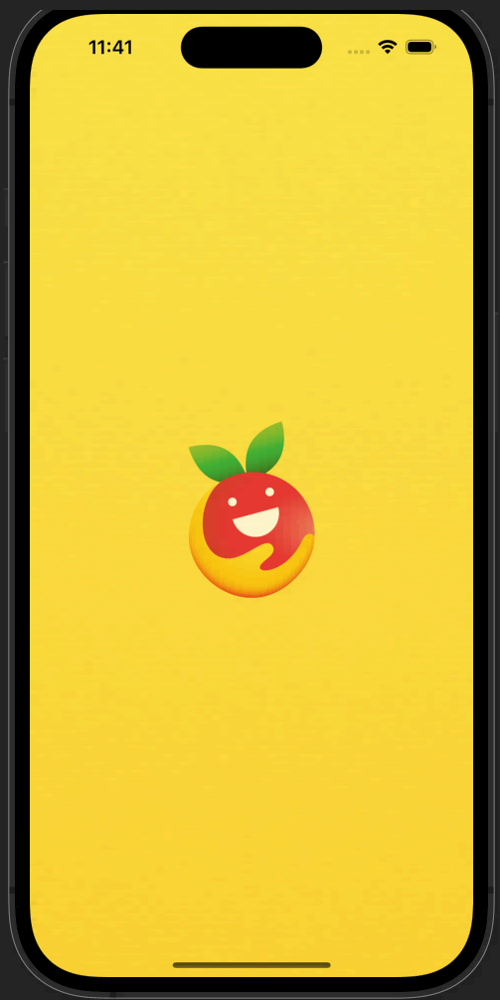
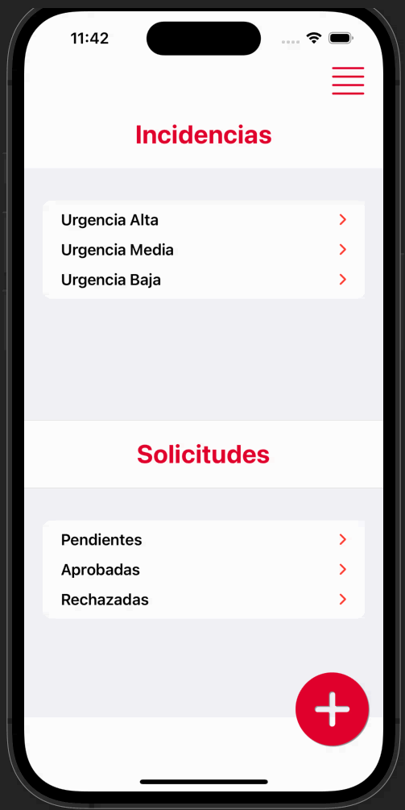
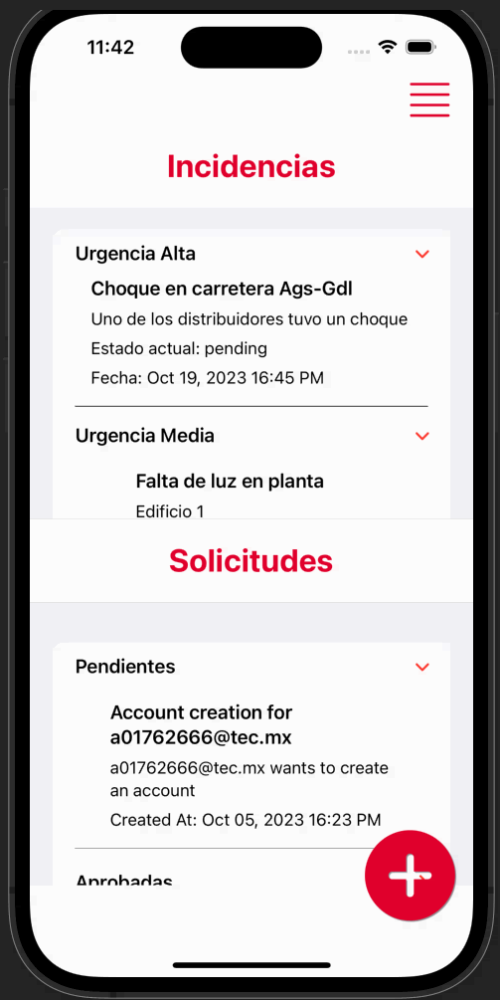
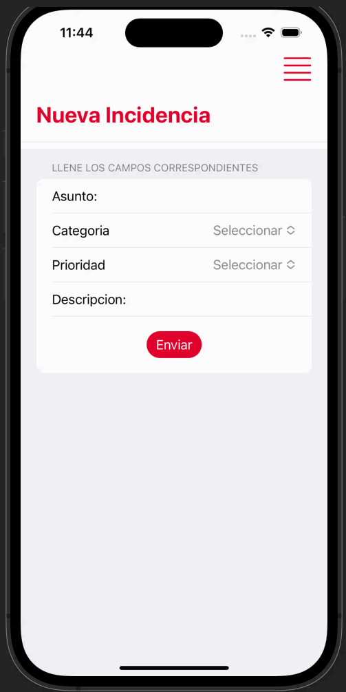
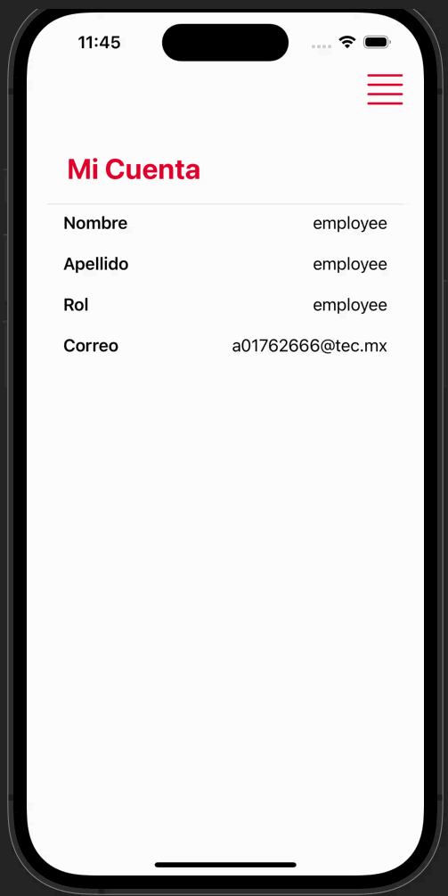
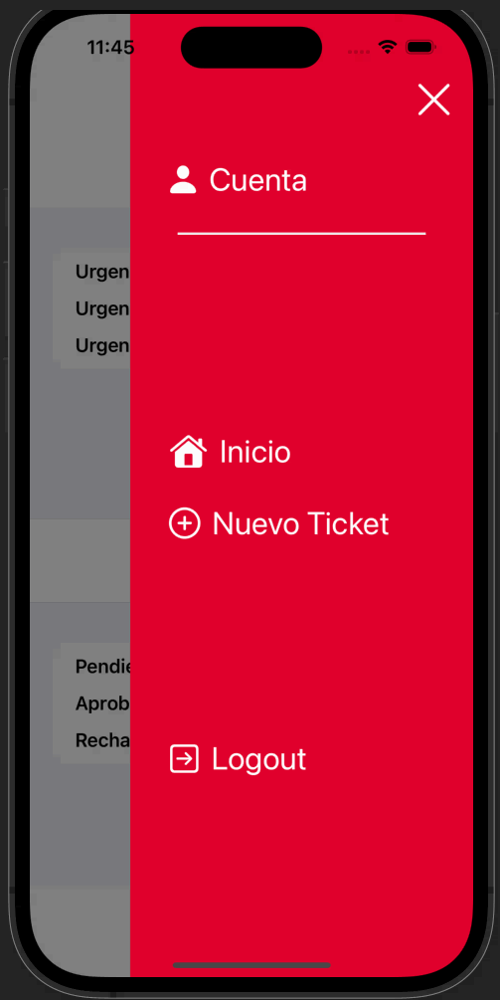
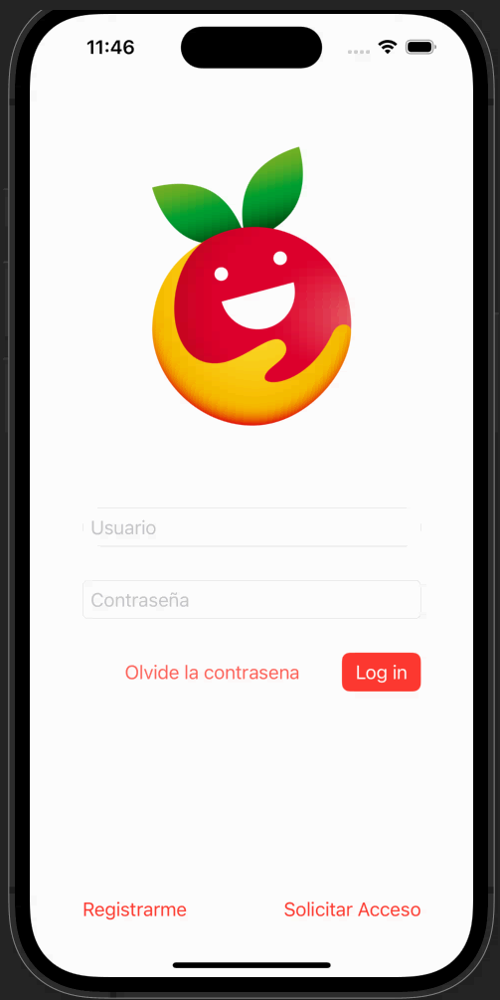
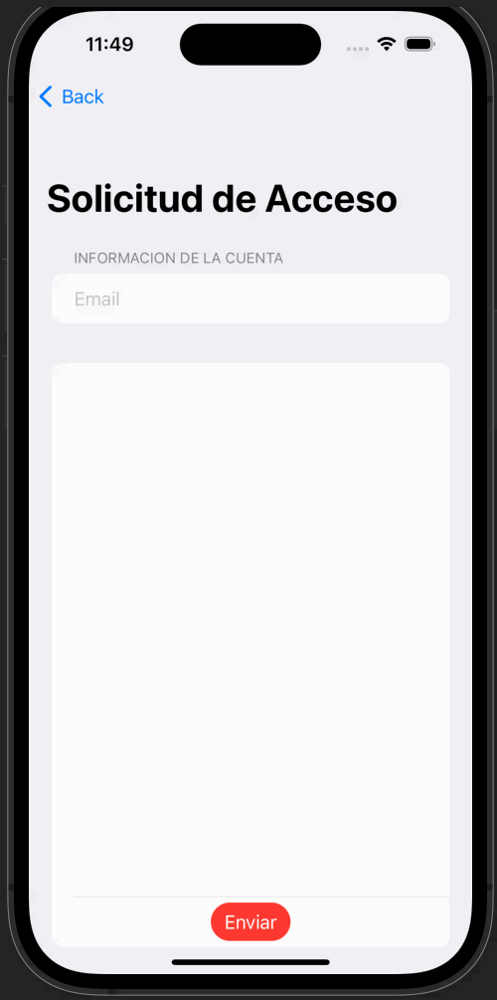
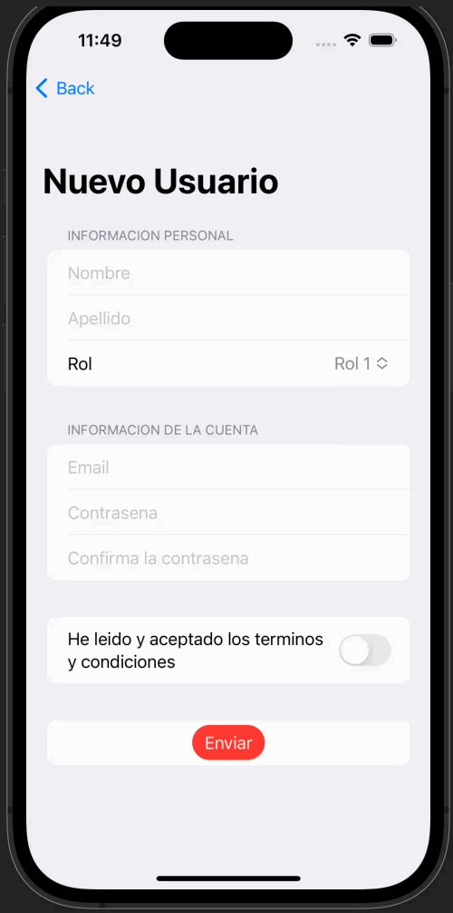

# Project Readme

## Introduction

This project represents the culmination of a 10-week mobile development effort, involving a team of three individuals. Our mission was to create a comprehensive solution for the Banco de Alimentos de Guadalajara, a non-profit organization. They required a streamlined system for managing internal incidents, optimizing team coordination and management.

## Project Components

### Frontend

**Technology:** Swift UI  
**Architecture:** Model-View-Controller (MVC)

The frontend of the application was entirely crafted using Swift UI. This framework allowed us to build a responsive and intuitive user interface. The MVC architecture was employed to ensure clean separation of concerns, making the codebase more maintainable and extensible.

### Backend

**Technology:** FastAPI with Python  
**Database:** MongoDB

The backend of our application was developed using FastAPI, a modern and efficient Python framework for building APIs. The database was hosted on MongoDB, providing a scalable and flexible data storage solution.

### Authentication

Our application features a robust authentication system, ensuring the security and privacy of the data. It supports two distinct user profiles:

1. **Administrator:** This profile is designed for overseeing and managing the system, allowing control over user access and system configuration.

2. **Worker:** Workers utilize the application for day-to-day tasks and reporting incidents. Their access is tailored to their specific roles and responsibilities.

## Development Methodology

Throughout the project's development, we rigorously adhered to the SCRUM methodology, a well-established agile framework. This approach allowed us to work in iterations, responding to changing requirements, and ensuring close collaboration with stakeholders. To streamline our project management and task tracking, we used the *Jira Software* management system.

--- 

## Images:

### Main Screen

---
## Login Screen:

